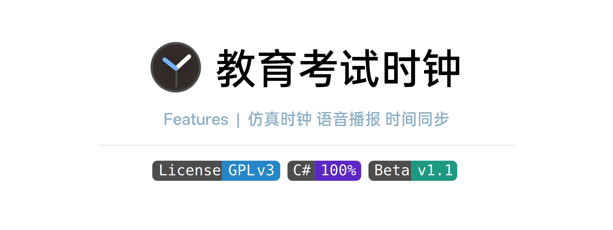

## 功能 / Features

### 仿真时钟

参照考试用表样式设计用户界面，营造更真实的考试环境。

### 考试日程安排

便捷地设置每场考试的科目、开始时间、持续时长。

### 语音播报

- 开考铃
- 收卷前10/15分钟播报
- 结束铃

### 系统时间校准

> [!NOTE]
>
> 此功能可能不稳定

通过局域网内运行本软件的其他主机，校准本机的时间。

## 开始使用 / Getting Started

下载完成后，请将压缩文件中的**所有文件**解压至一个空文件夹，运行 `ExamClock.exe` 即可。

在进行了相关设置后，会在程序所在目录保存一个 `config.spf` 文件，这是配置文件。

> [!WARNING]
>
> 请不要直接修改配置文件，否则可能导致软件无法读取！

## 致谢 / Credits

本项目使用了以下字体：

**[OPPO Sans 3.0](https://www.coloros.com/article/A00000050/)**

本项目基于**WPF**框架开发。

## 许可证 / License

本项目采用 **GNU General Public License v3.0** 许可证。完整的条款和条件请参见项目根目录中的 [LICENSE](LICENSE.txt) 文件。

请遵守当地的法律法规，和本项目的开源协议。

> Copyright (C) 2025 Zachary Cao - [CaozyDevp@github](https://github.com/caozydevp)
