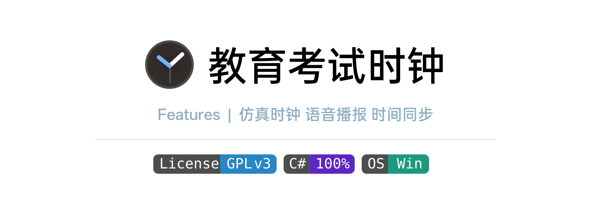

## 功能 / Features

### 仿真时钟

参照考试用表样式和实际情况设计用户界面，营造更真实的考试环境。

### 考试日程安排

便捷地设置每场考试的科目、开始时间、持续时长。

### 语音播报

- 开考铃
- 收卷前10/15分钟播报
- 结束铃

### 系统时间同步

在同一广播域内，将本考场主机的时间与其他考场的主机同步。

> [!NOTE]
> 
> 时间同步消息中传输的时间分度值为1ms，实际误差基本可控制在1s以内。

### 集中管控

管理端可以向运行考试时钟软件的各考场下发日程安排、修改配置信息、控制系统音量、切换考试状态等。

> [!NOTE]
>
> 此功能仍在`dev`分支开发中，即将发布。

## 开始使用 / Getting Started

下载完成后，请将压缩文件中的**所有文件**解压至一个空文件夹，运行 `ExamClock.exe` 即可。

在进行了相关设置后，会在程序所在目录保存一个 `config.spf` 文件，这是配置文件。在软件中进行的所有设置都会被保存在这个配置文件中。

> [!WARNING]
> 
> 请不要直接修改配置文件，否则可能导致其无法被软件正常读取和解析！

您可以将该文件共享给其他人，以便同步所有的配置。如果希望导入配置文件，请按照“修改配置>总览>导入配置”进行操作。导入的配置文件将覆盖程序所在目录下原有的配置文件，此后做出的修改仍将保存在软件所在目录的配置文件中。

## 致谢 / Credits

本项目使用了以下字体：

- **[OPPO Sans 3.0](https://www.coloros.com/article/A00000050/)**

本项目引用了以下开源框架：

- **[NAudio](https://github.com/naudio/NAudio)**

- **[HandyControl](https://github.com/HandyOrg/HandyControl)**

本项目基于**WPF**框架开发。

## 许可证 / License

本项目采用 **GNU General Public License v3.0** 许可证。完整的条款和条件请参见项目根目录中的 [LICENSE](LICENSE.txt) 文件。

使用本软件时，请遵守所在地的法律法规。使用和分发时，请遵循本项目的开源协议。

> Copyright (C) 2025 Zachary Cao - [CaozyDevp@github](https://github.com/caozydevp)
